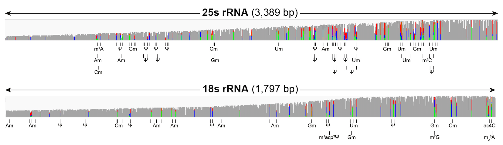

# Analysis of Ribosomal RNA sequences



## 1. Base-called features of rRNA modifications

### Dot-plots of each distinct type of modification (Figure 2B)
```
Rscript mods_dotplot.R <epinano_5mer.csv> all_rrna_mod_status.tsv
```
Example using test data:

```
Rscript mods_dotplot.R test_data/wt_epinano_5mer.csv all_rrna_mod_status.tsv
```


### Ternary plots (base-frequency) of each distinct type of modification (Figure 2C)
```
Rscript mods_ternary.R <epinano.csv> all_rrna_mod_status.tsv
```
Example using test data:

```
Rscript mods_ternary.R test_data/wt_epinano.csv all_rrna_mod_status.tsv
```

 


### 5-mer dotplots for each mods
```
Rscript dotplot_5mer <epinano_5mer.csv> rrna_mod_5mer.tsv
```
Example using test data:

```
Rscript dotplot_5mer wt.bam.tsv.per.site.var.per_site_var.5mer.csv rrna_mod_5mer.tsv
```

 