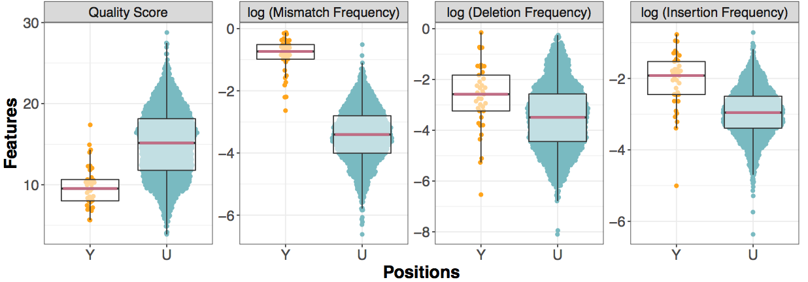

# Analysis of Ribosomal RNA sequences


## 1. Base-called features of rRNA modifications

### Dot-plots of each distinct type of modification
```
Rscript mods_dotplot.R <epinano_5mer.csv> all_rrna_mod_status.tsv
```
Example using test data:

```
Rscript mods_dotplot.R test_data/wt_epinano_5mer.csv all_rrna_mod_status.tsv
```



