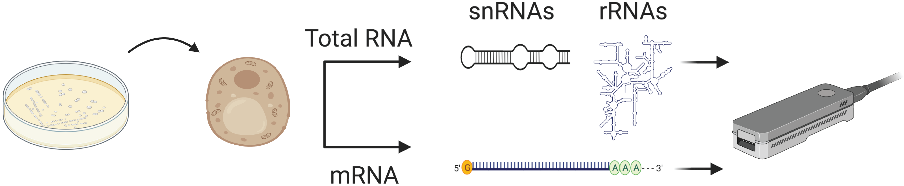

# Analysis of Direct RNA Sequencing data for :
-  Saccharomyces cerevisiae ribosomal RNAs (rRNAs)
-  Saccharomyces cerevisiae small nuclear and small nucleolar RNAs (sn/snoRNAs)
-  Saccharomyces cerevisiae messenger RNAs (mRNAs)

To reproduce the full results, you will need the FAST5 and FASTQ files related to yeast RNA analyses can be found [here](https://www.ebi.ac.uk/ena/browser/view/PRJEB37798) (total RNA) and [here](https://www.ebi.ac.uk/ena/browser/view/PRJEB41495) (polyA-selected RNA)

Demo/test data to run the scripts is included in each of the Analysis sections:
- [Test data](https://github.com/novoalab/yeast_RNA_Mod/tree/master/Analysis/NanoCMCSeq/test_data) for NanoCMC-seq 
- [Test data](https://github.com/novoalab/yeast_RNA_Mod/tree/master/Analysis/ncRNA/test_data) for ncRNA analyses
- [Test data](https://github.com/novoalab/yeast_RNA_Mod/tree/master/Analysis/rRNA) for rRNA analyses

## What's included:

### Tools 
-  [Epinano](https://github.com/novoalab/yeast_RNA_Mod/tree/master/Softwares) base frequency version in order to analyse direct RNA sequencing bam files
-  [Bam2Stats](https://github.com/novoalab/yeast_RNA_Mod/tree/master/Softwares) tool in order to analyse NanoCMC-Seq bam files]

### Bash scripts 
-  [Pre-process the files for R analysis](https://github.com/novoalab/yeast_RNA_Mod/tree/master/Analysis/Epinano)

### R scripts
-  [Process ribosomal RNA runs](https://github.com/novoalab/yeast_RNA_Mod/tree/master/Analysis/rRNA)
-  [Process sn/snoRNA runs](https://github.com/novoalab/yeast_RNA_Mod/tree/master/Analysis/ncRNA)
-  [Process mRNA runs](https://github.com/novoalab/yeast_RNA_Mod/tree/master/Analysis/mRNA)
-  [Process NanoCMC-Seq runs](https://github.com/novoalab/yeast_RNA_Mod/tree/master/Analysis/NanoCMCSeq)

## Stoichiometry prediction 
- If you'd like to predict stochiometry (difference in RNA modification levels) between two samples (e.g. wild type vs knockout, normal vs heat stress), you may wish to look at the [NanoRMS](https://github.com/novoalab/nanoRMS/blob/master/README.md) GitHub repository. 
- 

## Dependencies/requirements: 
Following R Packages are needed to run the scripts: 
|R packages|
|----|
|plyr|
|stringr|
|reshape2|
|dplyr|
|ggplot2|
|ggbeeswarm|
|ggpubr|
|data.table|

## Citation:
Begik, O., Lucas, M.C., Pryszcz, L.P. et al. Quantitative profiling of pseudouridylation dynamics in native RNAs with nanopore sequencing. Nat Biotechnol (2021). https://doi.org/10.1038/s41587-021-00915-6

## Citation:
Please open an issue in the GitHub repo if you have any questions/doubts/suggestions about how to use this software. Thanks!
